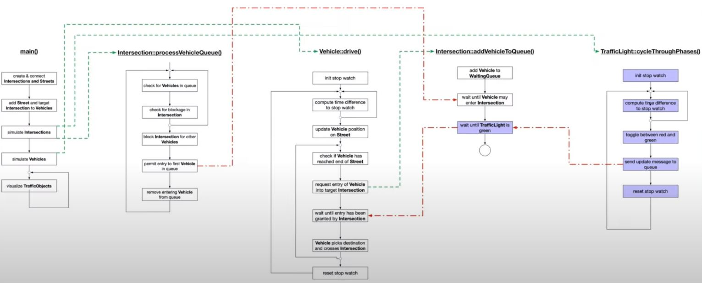

# Concurrent-Traffic-Simulation
This is my solution for the 4th project in the [Udacity C++ Nanodegree Program](https://www.udacity.com/course/c-plus-plus-nanodegree--nd213): Concurrency. The goal of this project is to a implement a suitable &amp; thread-safe communication protocol between vehicles and intersections acting as traffic lights to complete the simulation. The original code base can be found [here](https://github.com/udacity/CppND-Program-a-Concurrent-Traffic-Simulation). When the project is built using the original code base, all traffic lights will be green. After implementation of my thread-safe communication protocol between vehicles and intersections the traffic simulation runs with traffic lights controlling the traffic flow at intersections.

## Dependencies for Running Locally
This section lists the dependencies of the application and how to get them.

* cmake >= 2.8
  * All OSes: [click here for installation instructions](https://cmake.org/install/)
* make >= 4.1 (Linux, Mac), 3.81 (Windows)
  * Linux: make is installed by default on most Linux distros
  * Mac: [install Xcode command line tools to get make](https://developer.apple.com/xcode/features/)
  * Windows: [Click here for installation instructions](http://gnuwin32.sourceforge.net/packages/make.htm)
* OpenCV >= 4.1
  * The OpenCV 4.1.0 source code can be found [here](https://github.com/opencv/opencv/tree/4.1.0)
* gcc/g++ >= 5.4
  * Linux: gcc / g++ is installed by default on most Linux distros
  * Mac: same deal as make - [install Xcode command line tools](https://developer.apple.com/xcode/features/)
  * Windows: recommend using [MinGW](http://www.mingw.org/)

## Basic Build Instructions
This section explains how to build &amp deploy the application.  

1. Clone this repo.
2. Make a build directory in the top level directory: `mkdir build && cd build`
3. Compile: `cmake .. && make`
4. Run it: `./traffic_simulation`.

## Overview of the Traffic Simulator

## Architecture of the Application
This section gives an orverview of the source code. The overview of the application's source code is displayed in the diagram below. Components and methods that have been modified (when compared to the orgininal source code) are marked in light blue here. Modified components and methods are
* Intersection::addVehicleToQueue()
  * vehicles must wait until traffic light turned green to enter an intersection
* TrafficLight::cycleThroughPhases()
  * stop watch is initialized
  * time differences are computed internally in order to...
  * ...toggle between green and red in time
  * a change in traffic light is reported to the intersection in order to manage waiting vehicles appropriately
  * the stop watch is re-initialized

## Changes made to the Original Source Code

## Wrap up of Threads

## Wrap up of Mutexes and Locks
